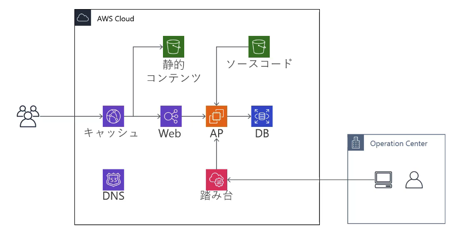
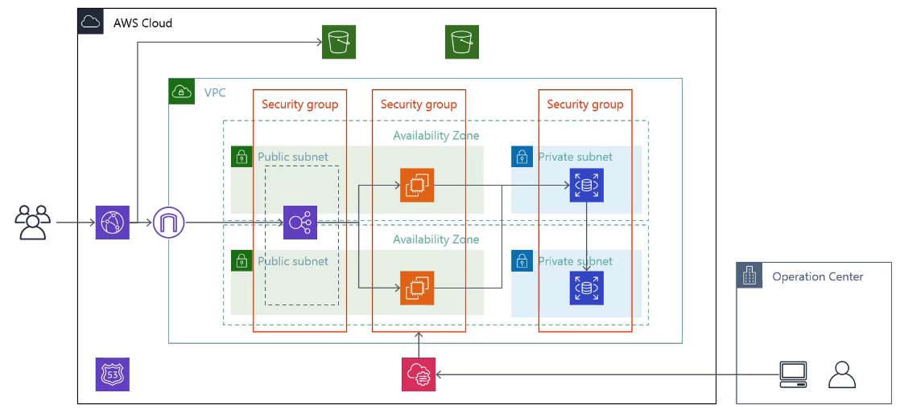

# Web 애플리케이션 개요

강의에서 다루는 Web 애플리케이션은 **사용자 트래픽 → CDN → 로드밸런서 → 애플리케이션 서버 → 데이터베이스**로 이어지는 다층 구조이며, 정적 자산·배포 아티팩트는 S3에 두고, DNS는 Route 53으로 연결하는 형태입니다. 운영자 접속은 **Bastion(踏み台)** 경로 또는 **SSM Session Manager** 경로로 나뉩니다.

---

## 1. 개념 아키텍처 (서비스 관점)

Bastion을 통한 관리 접속이 포함된 흐름입니다.

**요약**

- 사용자: CloudFront(캐시)로 진입 → 필요 시 S3에서 정적 파일, 동적 요청은 Web(ELB 등)으로 전달.
- 애플리케이션: EC2(AP)가 RDS(DB)에 접속해 데이터 처리.
- 배포: 소스 코드를 S3에 두고 AP에서 가져오는 흐름으로 표현됩니다.
- 운영: 운영 센터 → Bastion(踏み台) → AP로 관리 접속.

---

## 2. VPC·다중 AZ 상세 (네트워크 관점)

퍼블릭 서브넷에 ALB, 프라이빗에 RDS를 두고 EC2는 앱 티어로 두는 **고가용성** 구성입니다. 관리는 **Systems Manager(Session Manager)** 로 EC2에 접속하는 패턴입니다.

**요약**

- **다중 AZ**: EC2·RDS를 두 영역에 배치해 한쪽 장애에도 서비스 지속.
- **서브넷**: ALB는 퍼블릭, DB는 프라이빗에 두어 노출 최소화.
- **보안 그룹**: Web(ALB), App(EC2), DB(RDS) 티어별로 분리하는 것이 일반적입니다.
- **관리**: 운영 센터 → SSM → EC2로 **Bastion 없이** 접속하는 패턴.