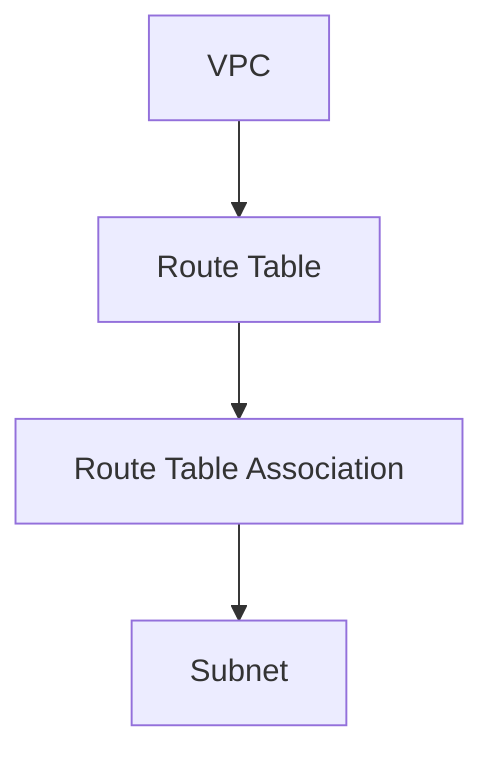

# 36. 라우터 테이블 (Route Table)

강의에서 말하는 **라우팅 테이블**은 VPC 안에서 **“어디로 패킷을 보낼지”** 를 정하는 리소스입니다. Terraform에서는 **테이블을 만드는 것**과 **서브넷에 붙이는 것**이 **서로 다른 리소스**입니다.

## 데이터 구조 (강의 도식 요약)

VPC 아래에 **라우트 테이블**이 있고, **라우트 테이블 연결(association)** 을 통해 **서브넷**과 묶입니다. 즉 “서브넷이 어떤 라우팅 테이블 규칙을 쓸지”는 **연결 리소스**가 담당합니다.



---

## `aws_route_table`

라우팅 테이블 **본체**를 만듭니다. (슬라이드 표 기준)

| 항목 | 타입 | 설명 |
| :--- | :--- | :--- |
| **vpc_id** * | string | 속할 VPC의 ID |
| **tags** | object(map) | Name 등 태그 |

`*` 는 슬라이드 기준 **필수**입니다.

**참고:** VPC를 만들면 AWS가 **메인(기본) 라우팅 테이블**을 자동으로 하나 만듭니다. 이름 태그가 없으면 콘솔 Name 칸이 `-` 로 보일 수 있습니다. 강의처럼 퍼블릭/프라이빗용으로 **별도 `aws_route_table`** 을 두면, 같은 VPC에 테이블이 여러 개 생깁니다.

---

## `aws_route_table_association`

**어느 서브넷**이 **어느 라우트 테이블**을 쓸지 연결합니다.

| 항목 | 타입 | 설명 |
| :--- | :--- | :--- |
| **route_table_id** * | string | 연결할 라우트 테이블 ID |
| **subnet_id** * | string | 연결할 서브넷 ID |

둘 다 필수입니다. 퍼블릭 서브넷 여러 개에 **같은** `public` 라우트 테이블을 쓰려면, 서브넷마다 association 블록을 하나씩 두면 됩니다.

---

## 실습 코드 위치

라우트 테이블과 연결은 **`terraform/network.tf`** 에 있습니다.

```83:123:terraform/network.tf
resource "aws_route_table" "public_rt" {
  vpc_id = aws_vpc.vpc.id

  tags = {
    Name    = "${var.project}-${var.environment}-public-rt"
    Project = var.project
    Env     = var.environment
    Type    = "public"
  }
}

resource "aws_route_table_association" "public_rt_1a" {
  route_table_id = aws_route_table.public_rt.id
  subnet_id      = aws_subnet.public_subnet_1a.id
}

resource "aws_route_table_association" "public_rt_1c" {
  route_table_id = aws_route_table.public_rt.id
  subnet_id      = aws_subnet.public_subnet_1c.id
}

resource "aws_route_table" "private_rt" {
  vpc_id = aws_vpc.vpc.id

  tags = {
    Name    = "${var.project}-${var.environment}-private-rt"
    Project = var.project
    Env     = var.environment
    Type    = "private"
  }
}

resource "aws_route_table_association" "private_rt_1a" {
  route_table_id = aws_route_table.private_rt.id
  subnet_id      = aws_subnet.private_subnet_1a.id
}

resource "aws_route_table_association" "private_rt_1c" {
  route_table_id = aws_route_table.private_rt.id
  subnet_id      = aws_subnet.private_subnet_1c.id
}
```

이후 단계에서 **`aws_route`** 로 `0.0.0.0/0` → IGW 등 **개별 라우트**를 테이블에 추가하는 내용이 이어질 수 있습니다.

## 콘솔에서 확인할 때

VPC **리소스 맵**에서 서브넷에 마우스를 올리면, 연결된 라우트 테이블이 강조됩니다. 목록만 보면 메인 테이블과 헷갈리기 쉬우니, 헷갈리면 **리소스 맵·CLI(`describe-route-tables`)** 로 맞춰 보면 됩니다.
