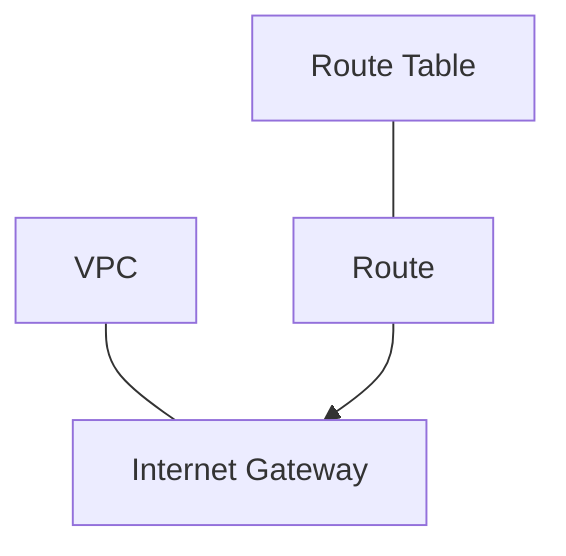

# 37. 인터넷 게이트웨이 (Internet Gateway)

VPC와 인터넷 사이를 잇는 **인터넷 게이트웨이(IGW)** 를 만들고, **퍼블릭 라우트 테이블**에 **기본 라우트(`0.0.0.0/0`)** 를 추가하는 흐름입니다. Terraform에서는 **리소스가 나뉘어** 정의됩니다.

## 관계 (강의 도식 요약)

VPC에 IGW를 붙이고, **라우트 테이블**에 들어가는 **라우트 한 줄**이 그 IGW를 **대상(target)** 으로 가리킵니다. 콘솔에서는 탭이 나뉘어 있어 한눈에 안 보일 수 있지만, 구조는 아래와 같습니다.



- **IGW** → 특정 **VPC**에 연결 (`vpc_id`).
- **Route** → 어느 **route table**의 어떤 **목적지 CIDR**를 어디로 보낼지 정함. 인터넷으로 나가는 경우 보통 `0.0.0.0/0` → **IGW**.

---

## `aws_internet_gateway`

슬라이드 표 기준 인자입니다.

| 항목 | 타입 | 설명 |
| :--- | :--- | :--- |
| **vpc_id** * | string | IGW를 붙일 VPC ID |
| **tags** | object(map) | Name 등 태그 |

`*` 는 슬라이드 기준 필수입니다.

---

## `aws_route` (IGW로 나가는 경우)

강의 슬라이드는 **인터넷 게이트웨이를 타겟으로 하는 라우트**에 초점을 맞춘 표입니다.

| 항목 | 타입 | 설명 |
| :--- | :--- | :--- |
| **route_table_id** * | string | 라우트를 넣을 라우트 테이블 ID |
| **destination_cidr_block** * | string | 목적지 CIDR (예: `0.0.0.0/0` = 그 외 전부) |
| **gateway_id** * | string | 인터넷 게이트웨이 ID |

**참고:** 실제 Terraform에서는 목적지에 따라 `nat_gateway_id`, `vpc_peering_connection_id` 등 **다른 target 인자**를 쓰는 라우트도 있어서, 슬라이드의 세 가지는 **“IGW로 퍼블릭 인터넷 나가기”** 패턴에 해당할 때의 필수 항목으로 이해하면 됩니다.

---

## 실습 코드 위치

IGW와 퍼블릭 라우트는 **`terraform/network.tf`** 에 있습니다.

```129:147:terraform/network.tf
resource "aws_internet_gateway" "igw" {
  vpc_id = aws_vpc.vpc.id

  tags = {
    Name    = "${var.project}-${var.environment}-igw"
    Project = var.project
    Env     = var.environment
  }
}

# ----
# Route
# ----

resource "aws_route" "public_rt_igw_r" {
  route_table_id         = aws_route_table.public_rt.id
  destination_cidr_block = "0.0.0.0/0"
  gateway_id             = aws_internet_gateway.igw.id
}
```

- **`public_rt`** 에만 이 라우트를 두고, 그 테이블에 **퍼블릭 서브넷**을 association 해 두면, 리소스 맵에서 **퍼블릭 서브넷 → public RT → IGW** 로 이어지는 그림이 됩니다.
- **프라이빗 RT**에는 보통 `0.0.0.0/0` → IGW 라우트를 넣지 않습니다. (나중에 NAT 게이트웨이 등 다른 패턴을 쓸 수 있음.)

## 콘솔에서 확인

- **VPC → 리소스 맵**: 퍼블릭 RT 선택 시 IGW와의 연결이 강조되는지 보면 됩니다.
- **VPC → 라우팅 테이블 → (퍼블릭 RT) → 라우팅 탭**: `0.0.0.0/0` 대상이 `igw-...` 인지 확인합니다.
