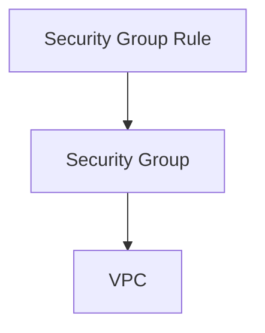

# 38. SG 리소스 그룹 (Security Group)

**보안 그룹(Security Group)** 은 VPC 안에서 **인스턴스 등 리소스에 붙는 가상 방화벽**이다. **“그룹(셸)”** 과 **“그 안의 허용 규칙”** 이 함께 다루어진다.

## 구조 (강의 도식)

- **VPC** 아래에 **보안 그룹**이 있고  
- **보안 그룹** 아래에 **보안 그룹 룰**이 붙는다.

강의 슬라이드 도식은 **화살표가 아래에서 위로** 그려져 있다. (룰이 속한 SG, SG가 속한 VPC를 가리키는 식의 **소속·연결** 표현)

클라우드 관점에서는 **AWS Cloud → VPC → Security group(VPC 내부)** 로 겹쳐 그려지기도 한다.

---

## `aws_security_group` (그룹 자체)

슬라이드 표 기준 인자이다.

| 항목 | 타입 | 설명 |
| :--- | :--- | :--- |
| **name** | string | 보안 그룹 이름 |
| **description** | string | 설명 |
| **vpc_id** | string | 속할 VPC ID |
| **tags** | object(map) | 태그 |

### `name` / `description` 을 안 주면

슬라이드 설명: **옵션이라 설정이 없으면 Terraform이 임의·고정값을 채울 수 있다**고 한다.  
실무에서는 **이름·설명을 명시**해 두는 편이 콘솔에서 구분하기 좋다.

---

## `aws_security_group_rule` (규칙 한 줄)

**어느 보안 그룹**에 **인바운드/아웃바운드**로 **어떤 프로토콜·포트·출발지**를 허용할지 정한다. 슬라이드 표 기준이다.

| 항목 | 타입 | 설명 |
| :--- | :--- | :--- |
| **security_group_id** * | string | 규칙을 넣을 보안 그룹 ID |
| **type** * | enum | `"ingress"`(인바운드) 또는 `"egress"`(아웃바운드) |
| **protocol** * | enum | `"tcp"`, `"udp"`, `"icmp"` 등 |
| **from_port** * | number | 시작 포트 (또는 ICMP 타입 범위 시작) |
| **to_port** * | number | 끝 포트 (또는 ICMP 타입 범위 끝) |
| **cidr_blocks** | list(string) | 허용할 IP 대역(CIDR) 목록. 예: `["0.0.0.0/0"]` |
| **source_security_group_id** | string | 출발지를 **다른 보안 그룹**으로 지정할 때 (예: ALB SG → EC2 SG) |

`*` 는 슬라이드 기준 **필수** 표시.

### `cidr_blocks` vs `source_security_group_id`

- **CIDR**: 특정 IP 범위(또는 전 세계 `0.0.0.0/0`)에서 오는 트래픽을 허용할 때.  
- **다른 SG ID**: “이 SG에 달린 리소스에서 오는 트래픽만” 허용할 때. (티어 간 통신에 자주 씀)

### 인라인 규칙과 분리 리소스

강의에서는 **`aws_security_group_rule` 을 따로 두는 방식**을 다룬다. `aws_security_group` 블록 안에 `ingress` / `egress` 블록으로 한꺼번에 적는 **인라인 방식**도 있으나, **규칙을 리소스로 쪼개면** 모듈·재사용·의존 관계를 나누기 쉽다.

### (참고) 상태 추적(Stateful)

보안 그룹은 **스테이트풀**에 가깝다. 인바운드로 들어온 응답 트래픽은 보통 별도 아웃바운드 규칙 없이도 연결이 유지되는 경우가 많다(개념만 알아 두면 됨).

---

## 실습 코드

현재 저장소 `terraform/` 에는 **아직 `aws_security_group` 정의가 없을 수 있다.** VPC는 `terraform/network.tf` 의 `aws_vpc.vpc` 등으로 잡혀 있으니, 이후 강의에서 **`vpc_id = aws_vpc.vpc.id`** 형태로 SG를 붙이게 된다.

---

## 정리

| 개념 | 역할 |
| :--- | :--- |
| **Security Group** | VPC 범위의 방화벽 “그룹”. 리소스에 attach |
| **Rule** | 그 그룹에 대한 허용 규칙(프로토콜·포트·출발지) |

다음 메모(39~41)에서 실제 SG 이름·룰 작성이 이어질 수 있다.
